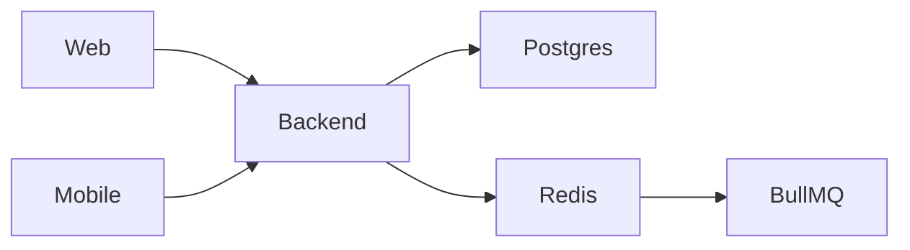

# Architecture

```mermaid
flowchart LR
  Web --> Backend
  Mobile --> Backend
  Backend --> Postgres
  Backend --> Redis
  Redis --> BullMQ
```

## DB Summary
Core tables: User, Doctor, Clinic, Specialty, Schedule, Appointment, Payment, Notification, VideoSession, AuditLog.
