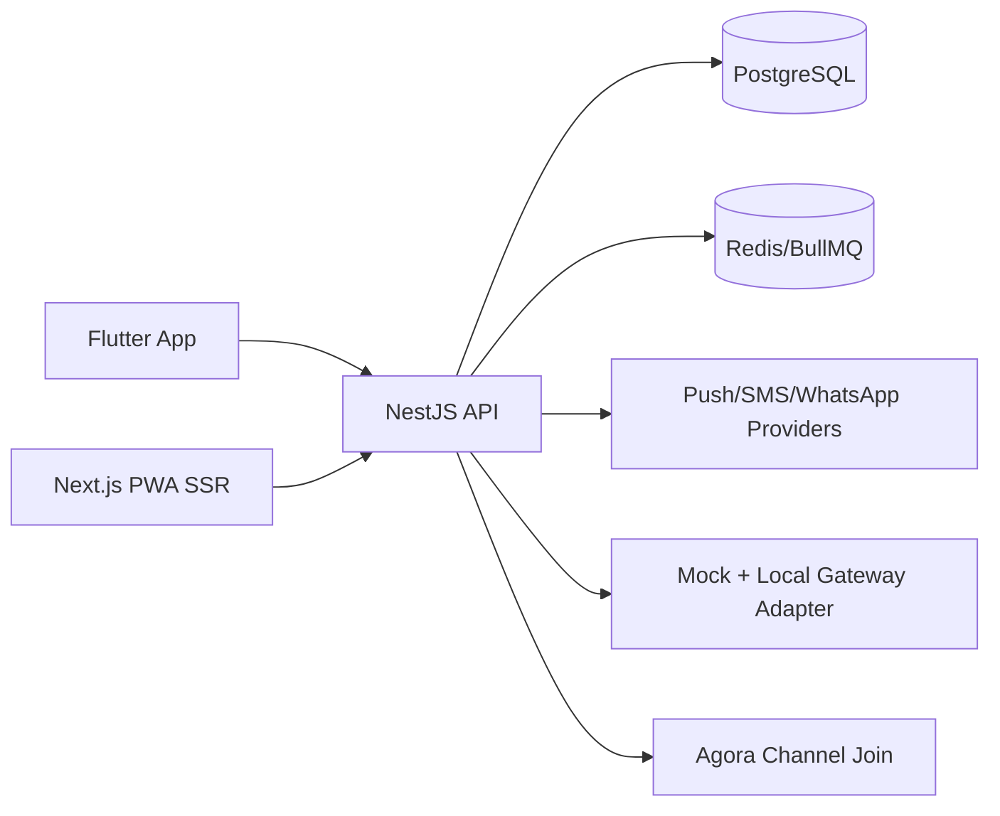

# Architecture Overview

```mermaid
flowchart LR
  Mobile[Flutter App] --> API[NestJS API]
  Web[Next.js PWA SSR] --> API
  API --> Postgres[(PostgreSQL)]
  API --> Redis[(Redis/BullMQ)]
  API --> Notif[Push/SMS/WhatsApp Providers]
  API --> Payment[Mock + Local Gateway Adapter]
  API --> Agora[Agora Channel Join]
```

- RBAC roles: SUPER_ADMIN, CLINIC_ADMIN, DOCTOR, RECEPTIONIST, PATIENT.
- Audit logs store actor/action/entity before/after + request metadata.
